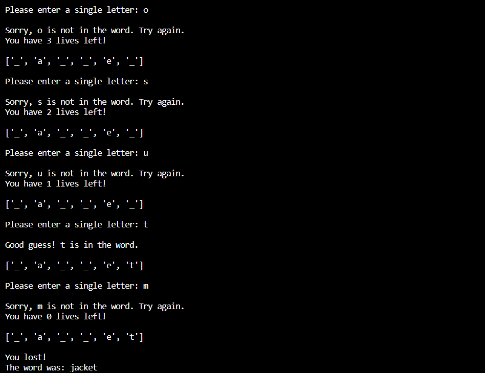

# Hangman
By **Joel Sud**

## Table of Contents:
- [Description](#description)
- [Installation Instructions](#installation-instructions)
- [Usage Instructions](#usage-instructions)
- [File Structure](#file-structure)
- [Project Documentation:](#project-documentation)
    - [Milestone 2](#milestone_2py)
    - [Milestone 3](#milestone_3py)
    - [Milestone 4](#milestone_4py)
    - [Milestone 5](#hangmanpy-milestone-5)

## Description: 
This is an Ai Core project. Hangman is a classic game in which a player thinks of a word and the other player tries to guess that word within a certain amount of attempts. This is an implementation of the Hangman game using Python, where the computer thinks of a word and the user tries to guess the word by providing character guesses!

Here is some example gameplay:

## Installation Instructions:
1. **Download and clone repository:**
- copy the repository URL by clicking '*<> Code*' above the list of files in GitHub Repo. Then copy and paste the '*HTTPS*' URL:
- in your CLI go to the location where you wish to clone your directory.
- Type the following '***git clone***' command with the '*HTTPS*' URL:

***
git clone https://github.com/joelsud18/hangman.git***

- Press 'Enter'.

## Usage Instructions
Run hangman.py. Within the code the variable word_list can be updated by appending new words for the computer to use. Running this script will enable the game to played, the computer will display the number of characters and the user will be asked to input a letter.

If the user inputs a correct letter, the number of missing letters will be updated. If the user inputs an incorrect letter, the number of lives left will decrease. The user gets a total of 5 lives to guess the word.

other files can be viewed to understand the development of this project.

## File Structure:

- hangman.py
- milestones
    - milestone_2.py
    - milestone_3.py
    - milestone_4.py
- hangman_screenshot.png

## Project Documentation

The following files are contained within the repository, they are the milestones or steps that led to the final game script (milestone_5 in hangman.py) They show the process of the development of the Hangman code.

### milestone_2.py:
 This defines the variables used within the game. This includes:

 - the word list containing all the words the computer chooses from.
        
        word_list = ['mango', 'strawberry', 'raspberry', 'orange', 'grapes']

 - the word selector.

        selected_word = random.choice(word_list) # The computer selects word at random from the list.

        user_guess = input("Please enter a single letter: ") # Computer asks user to make a guess by providing a character.
        # Computer will check the user guess is one character in length.
        if len(user_guess) == 1:
            print("Good Guess!")
        else:
            print("Oops! That is not a valid input.")

### milestone_3.py:
This imports the word from milsetone_2.py and defines the following functions:

- check_guess() which checks whether the guess is in the word.

        def check_guess(guess): # This function checks if a character is in the selected word.

        if guess in word:
            print(f"Good guess! {guess} is in the word.")
        else:
            print(f"Sorry, {guess} is not in the word. Try again.")
        guess.lower()

- ask_for_input() which asks the user for an input, verifies it is a single alphabetical character and then calls check_guess().

        def ask_for_input(): #This function asks for an input, validates it is a single alphabetical character and then calls the check guess function.
            while True:
                guess = input("Please enter a single letter: ") # Asks user to input a single alphabetical letter.
                validate_guess_is_alphabetical = guess.isalpha()
                if validate_guess_is_alphabetical == True and len(guess) == 1: # Checks to see that the guess is a) alphabetical and b) a single letter.
                    break
                else:
                    print("Invalid letter. Please, enter a single alphabetical character.")
            
            guess.lower() #converts character to lower case.

            check_guess(guess)

### milestone_4.py:
This takes the code from the previous milestones and develops the functions as methods under a 'Hangman' class, This file contains the following:

- Hangman class is defined.
- '__init__()' method is defined with following attributes:
    - self.word_list - list of words for computer to choose from.
    - self.num_lives - number of lives the user has.
    - self.word - a randomly selected word from the word_list.
    - self.word_guessed - a list containing how many characters have been guessed correctly from the word.
    - self.num_letters - the number of letters in the selected word.
    - self.list_of_guesses - every character that the user has guessed.
    - self.total_num_guesses - the total number of guesses made by the user.

            def __init__(self, word_list, num_lives = 5):

                '''
                See help(Hangman) for accurate signature.
                '''

                self.word_list = word_list
                self.num_lives = num_lives

                self.word = random.choice(self.word_list)
                self.word_guessed = ['_'] * len(self.word)
                self.num_letters = len(self.word)
                self.list_of_guesses = []
                self.total_num_guesses = 0

- 'check_guess()' method is defined which:
    - makes the guessed character lower case.
    - if the guess is in the word it notifies the user and adds the letter to the words_guessed list.
    - if the guess is not in the word, the user is notified and a life is taken away from num_lives.

            def check_guess(self, guess):
        
                '''
                This method is used to check whether the letter guessed by the user is in the selected word. if not then it takes a life away from the user.

                Args:
                    guess (string): This is the letter input from the user.
                '''

                guess.lower()
                if guess in self.word:
                    print(f"Good guess! {guess} is in the word.")
                    index = 0
                    for letter in self.word:
                        if letter == guess:
                            self.word_guessed[index] = guess
                            self.num_letters -= 1
                        index += 1
                else:
                    self.num_lives -= 1
                    print(f"Sorry, {guess} is not in the word. Try again.")
                    print(f"You have {self.num_lives} left!")

- 'ask_for_input' method is defined which:
    - asks the user for an input.
    - verifies whether the input is a single alphabetical character that has not already been guessed. If it is, they are asked for anotehr input.
    - if it is a valid input it is added to the list_of_guesses and passed through to the check_guess() method.

            def ask_for_input(self):

                '''
                This method asks the user for an input and checks that the letter is:
                    1. a single character
                    2. alphabetical
                    3. not been guessed before
                if the input is valid then it passes it as an argument into the check_guess() method.
                '''

                while True:
                    guess = input("Please enter a single letter: ")
                    validate_guess_is_alphabetical = guess.isalpha()
                    if validate_guess_is_alphabetical == False or len(guess) != 1:
                        print("Invalid letter. Please, enter a single alphabetical character.")
                    elif guess in self.list_of_guesses:
                        print("You already tried that letter.")
                    else:
                        self.check_guess(guess)
                        self.list_of_guesses.append(guess)
                        self.total_num_guesses += 1

### hangman.py (milestone 5):

This takes all the code form milestone_4.py and integrates it into a function that codes the logic of the game. This file shoud be run for the game to be initialised and run for the user to play!

It contains the class from milestone_4 but also defines:

- play_game() function is defined to code the logic of the game it. It creates an instance of the hangman class and calls the ask_for_input() method which subsequently calls the check_guess() method. This function is called so when this script is run the game is run.

        def play_game(word_list):

            '''
            This function defines the logic of the game by taking in a word list and creating an instance of the hangman class and calling both of its methods. 

            Args:
                word_list (list): the list of words the game is played from.
            '''

            num_lives = 5
            game = Hangman(word_list, num_lives)
            print(f"\n Guess the word: \n{game.word_guessed} \n")
            while True:
                game.ask_for_input()
                if game.num_lives == 0:
                    print(f"You lost!\nThe word was: {game.word}")
                    break
                else:
                    print(f"Congatulations! You won the game!\nthe word was: {game.word}")
                    print(f"it took you {game.total_num_guesses} guesses to win!\n")
                    break
